# Database Schema — Kabirian College Management System

Status: sections **1–5, 8 and 9 are built and applied** to the college's database (seven migrations, to 2026-08-30). Sections **6 (timetable) and 7 (communication) remain proposed** — they are a Phase 0 sketch and will be revised when those phases are built, the way section 5 was. · Database: PostgreSQL 18 · ORM: Prisma

Conventions
- Table names: `snake_case`, plural. Column names: `snake_case`. Prisma models map to these with `@@map`/`@map`.
- Every table has `id uuid PRIMARY KEY` (UUID v7) unless stated, plus `created_at timestamptz DEFAULT now()` and `updated_at timestamptz` (maintained by Prisma).
- `timestamptz` for moments in time; `date` for calendar dates (attendance, DOB, exam dates). Times of day are `varchar(5)` holding `HH:MM`, checked by a regex — a wall-clock slot on a date sheet is not an instant, and storing it as `time` invites timezone conversion.
- Marks: `numeric(6,2)`. Percentages: `numeric(5,2)`.
- ✱ = required (NOT NULL). FK = foreign key. `ON DELETE` is `RESTRICT` unless stated (history must never vanish by accident).
- Items marked **[SQL]** need hand-written SQL inside the Prisma migration (partial indexes, check constraints, `NULLS NOT DISTINCT`).

---

## 0. The academic structure in one picture

```
BUILDING BLOCKS (defined once, reused every session)
  classes    : 1st Year (11th Class, level 1) · 2nd Year (12th Class, level 2)
  divisions  : Boys · Girls
  programs   : Pre-Medical · Pre-Engineering · ICS Physics · ICS Economics · FAIT
  subjects   : Biology, Chemistry, Physics, Mathematics, Computer Science, Economics, English, Urdu, …

THIS SESSION'S STRUCTURE (built from the blocks; frozen as history when the session closes)
  academic_sessions      2026-27
  └── academic_groups    Session × Class × Division × Program        → 2 × 2 × 5 = 20 rows today
      └── sections       A, B, …  (one or more per group)            → students sit here, teachers teach here
  curriculum_subjects    Session × Class × Program → Subjects         → 2 × 5 = 10 curricula today

PEOPLE ↔ STRUCTURE
  student_enrollments    Student → Section (+ roll number, status)   → one per student per session
  teacher_assignments    Staff   → Section + Subject                  → subject must be in the group's curriculum
```

Reading a section upwards gives everything: `section → academic_group → { academic_session, class, division, program }`.

Example row of `academic_groups`: *2026-27 · 1st Year · Boys · Pre-Medical*. Example `sections` row: *… · A*. Example enrollment: *Ali Ahmed → 2026-27 · 1st Year · Boys · Pre-Medical · A, roll 105, ACTIVE*.

---

## Entity-relationship overview

```mermaid
erDiagram
  users ||--o| students : "account"
  users ||--o| staff : "account"
  users ||--o{ sessions : has
  users ||--o{ user_permissions : overrides
  permissions ||--o{ role_permissions : ""
  permissions ||--o{ user_permissions : ""

  academic_sessions ||--o{ academic_groups : ""
  classes ||--o{ academic_groups : ""
  divisions ||--o{ academic_groups : ""
  programs ||--o{ academic_groups : ""
  academic_groups ||--o{ sections : ""
  staff ||--o{ sections : "in-charge"

  academic_sessions ||--o{ curriculum_subjects : ""
  classes ||--o{ curriculum_subjects : ""
  programs ||--o{ curriculum_subjects : ""
  subjects ||--o{ curriculum_subjects : ""

  students ||--o{ student_enrollments : ""
  sections ||--o{ student_enrollments : ""
  staff ||--o{ teacher_assignments : ""
  sections ||--o{ teacher_assignments : ""
  subjects ||--o{ teacher_assignments : ""
  departments ||--o{ staff : ""

  sections ||--o{ attendance_sheets : ""
  subjects ||--o{ attendance_sheets : ""
  staff ||--o{ attendance_sheets : marks
  attendance_sheets ||--o{ attendance_entries : ""
  students ||--o{ attendance_entries : ""

  exam_types ||--o{ exams : ""
  academic_sessions ||--o{ exams : ""
  exams ||--o{ exam_papers : papers
  classes ||--o{ exam_papers : ""
  subjects ||--o{ exam_papers : ""
  programs ||--o{ exam_papers : "optional"
  exam_papers ||--o{ exam_mark_sheets : ""
  sections ||--o{ exam_mark_sheets : ""
  staff ||--o{ exam_mark_sheets : enters
  exam_mark_sheets ||--o{ marks : ""
  exam_papers ||--o{ marks : ""
  students ||--o{ marks : ""
  exams ||--o{ results : ""
  students ||--o{ results : ""
  sections ||--o{ results : snapshot
  grade_scales ||--o{ grade_bands : ""
  grade_scales ||--o{ results : "used"

  sections ||--o{ timetable_slots : ""
  subjects ||--o{ timetable_slots : ""
  staff ||--o{ timetable_slots : teaches

  notices ||--o{ notice_targets : ""
  document_types ||--o{ documents : ""
  students ||--o{ documents : ""
  staff ||--o{ documents : ""
  notices ||--o{ documents : attachments
  events ||--o{ documents : attachments
  users ||--o{ audit_logs : actor
```



---

## 1. Identity & access

### `users`
| Column | Type | Notes |
|---|---|---|
| id | uuid ✱ | PK |
| username | varchar(50) ✱ | Login identifier. **[SQL]** unique index on `lower(username)` |
| email | varchar(255) | Optional; unique when present |
| password_hash | text ✱ | Argon2id |
| role | enum `user_role` ✱ | `ADMIN`, `STAFF`, `STUDENT` |
| status | enum `user_status` ✱ | `ACTIVE`, `INACTIVE` (default `ACTIVE`) |
| must_change_password | boolean ✱ | default `true` |
| failed_login_attempts | int ✱ | default 0 |
| locked_until | timestamptz | lockout end |
| last_login_at | timestamptz | |
| password_changed_at | timestamptz | |
| is_system_owner | boolean ✱ | default false; the protected primary admin |
| created_at / updated_at | timestamptz ✱ | |

Indexes: `unique(lower(username))` [SQL], `unique(email)`, `(role, status)`.

### `sessions`
| Column | Type | Notes |
|---|---|---|
| id | uuid ✱ | PK |
| user_id | uuid ✱ | FK → users `ON DELETE CASCADE` |
| token_hash | char(64) ✱ | SHA-256 hex of the cookie token; unique |
| expires_at | timestamptz ✱ | |
| last_active_at | timestamptz ✱ | sliding expiry |
| ip_address | varchar(45) | |
| user_agent | varchar(512) | |
| created_at | timestamptz ✱ | |

Indexes: `unique(token_hash)`, `(user_id)`, `(expires_at)` (cleanup job).

### `permissions`
| Column | Type | Notes |
|---|---|---|
| key | varchar(64) ✱ | PK, e.g. `students.view` |
| module | varchar(32) ✱ | grouping for the UI |
| description | varchar(255) ✱ | |

### `role_permissions`
| Column | Type | Notes |
|---|---|---|
| role | enum `user_role` ✱ | |
| permission_key | varchar(64) ✱ | FK → permissions `ON DELETE CASCADE` |

PK `(role, permission_key)`.

### `user_permissions`
| Column | Type | Notes |
|---|---|---|
| user_id | uuid ✱ | FK → users `ON DELETE CASCADE` |
| permission_key | varchar(64) ✱ | FK → permissions `ON DELETE CASCADE` |
| effect | enum `permission_effect` ✱ | `GRANT`, `REVOKE` |
| granted_by_user_id | uuid | FK → users |
| created_at | timestamptz ✱ | |

PK `(user_id, permission_key)`.

---

## 2. Academic structure

### 2.1 Building blocks (session-independent lookups)

#### `classes` — academic years
| Column | Type | Notes |
|---|---|---|
| id | uuid ✱ | PK |
| name | varchar(60) ✱ | unique, e.g. `1st Year` |
| alternate_name | varchar(60) | e.g. `11th Class` (shown as "1st Year / 11th Class") |
| level | int ✱ | academic order used by promotion: 1, 2, … |
| is_active | boolean ✱ | default true |

Index `(level)`.

#### `divisions`
| Column | Type | Notes |
|---|---|---|
| id | uuid ✱ | PK |
| name | varchar(60) ✱ | unique, e.g. `Boys`, `Girls` |
| code | varchar(10) ✱ | unique, e.g. `B`, `G` |
| sort_order | int ✱ | |
| is_active | boolean ✱ | default true |

#### `programs` — groups such as Pre-Medical
| Column | Type | Notes |
|---|---|---|
| id | uuid ✱ | PK |
| name | varchar(80) ✱ | unique, e.g. `Pre-Medical`, `ICS Physics`, `FAIT` |
| code | varchar(20) ✱ | unique, e.g. `PM`, `PE`, `ICS-PHY`, `ICS-ECO`, `FAIT` |
| description | varchar(255) | |
| sort_order | int ✱ | |
| is_active | boolean ✱ | default true |

#### `subjects`
| Column | Type | Notes |
|---|---|---|
| id | uuid ✱ | PK |
| name | varchar(100) ✱ | unique, e.g. `Biology` |
| code | varchar(20) | unique when present |
| is_active | boolean ✱ | default true |

#### `departments` — for staff (e.g. Science, Arts, Administration)
| Column | Type | Notes |
|---|---|---|
| id | uuid ✱ | PK |
| name | varchar(100) ✱ | unique |
| code | varchar(20) | unique when present |
| is_active | boolean ✱ | default true |

Deactivating a block hides it from *new* structures and forms; it never changes past sessions.

### 2.2 Per-session structure

#### `academic_sessions`
| Column | Type | Notes |
|---|---|---|
| id | uuid ✱ | PK |
| name | varchar(20) ✱ | unique, e.g. `2026-27` |
| start_date | date ✱ | |
| end_date | date ✱ | **[SQL]** check `end_date > start_date` |
| status | enum `session_status` ✱ | `UPCOMING`, `ACTIVE`, `CLOSED` |
| is_current | boolean ✱ | default false. **[SQL]** partial unique index `WHERE is_current` (only one current) |

#### `academic_groups` — one row per Session × Class × Division × Program
| Column | Type | Notes |
|---|---|---|
| id | uuid ✱ | PK |
| academic_session_id | uuid ✱ | FK → academic_sessions |
| class_id | uuid ✱ | FK → classes |
| division_id | uuid ✱ | FK → divisions |
| program_id | uuid ✱ | FK → programs |
| is_active | boolean ✱ | default true |
| created_at / updated_at | timestamptz ✱ | |

Unique `(academic_session_id, class_id, division_id, program_id)`. Also `unique(id, academic_session_id)` so child tables can carry a composite FK that *proves* they belong to the same session. Display name is derived: `1st Year · Boys · Pre-Medical`.

Kabirian College today: 20 rows per session (2 classes × 2 divisions × 5 programs).

#### `sections`
| Column | Type | Notes |
|---|---|---|
| id | uuid ✱ | PK |
| academic_group_id | uuid ✱ | FK → academic_groups |
| academic_session_id | uuid ✱ | denormalised; composite FK `(academic_group_id, academic_session_id)` → academic_groups`(id, academic_session_id)` |
| name | varchar(20) ✱ | `A`, `B`, … |
| capacity | int | optional |
| incharge_staff_id | uuid | FK → staff; section in-charge (extra staff scope) |
| is_active | boolean ✱ | default true |
| created_at / updated_at | timestamptz ✱ | |

Unique `(academic_group_id, name)`; `unique(id, academic_session_id)` (for composite FKs from enrollments, assignments, sheets, slots). Index `(academic_session_id, is_active)`, `(incharge_staff_id)`.

Every group gets a section `A` automatically when created; more can be added at any time. A section is the unit for enrollment, attendance, timetable and teacher assignment.

#### `curriculum_subjects` — which subjects a Class × Program studies in a session
| Column | Type | Notes |
|---|---|---|
| id | uuid ✱ | PK |
| academic_session_id | uuid ✱ | FK |
| class_id | uuid ✱ | FK |
| program_id | uuid ✱ | FK |
| subject_id | uuid ✱ | FK |
| is_compulsory | boolean ✱ | default true (electives later) |
| sort_order | int ✱ | order on result cards |

Unique `(academic_session_id, class_id, program_id, subject_id)`. Index `(academic_session_id, class_id, program_id)`.

Why not per division or per section: Boys and Girls Pre-Medical study the same subjects, and so do sections A and B. Storing the list once per class × program (10 lists per session) removes duplication and drift. **A section's subjects are derived** = `curriculum_subjects` of its group's `(session, class, program)`. If a single section ever needs a deviation, a `section_subject_overrides` table can be added without changing anything else.

---

## 3. People

### `students`
| Column | Type | Notes |
|---|---|---|
| id | uuid ✱ | PK |
| user_id | uuid | FK → users, unique (account may be created later) |
| student_code | varchar(20) ✱ | unique, `STU-0001` |
| admission_number | varchar(30) ✱ | unique (college's own admission no.) |
| full_name | varchar(120) ✱ | |
| date_of_birth | date | |
| gender | enum `gender` | `MALE`, `FEMALE`, `OTHER` |
| phone | varchar(20) | |
| email | varchar(255) | |
| address | text | |
| city | varchar(80) | |
| cnic_bform_number | varchar(15) | `#####-#######-#`; **[SQL]** partial unique where not null |
| father_name | varchar(120) ✱ | |
| father_cnic | varchar(15) | |
| father_phone | varchar(20) | |
| father_occupation | varchar(100) | |
| mother_name | varchar(120) | |
| guardian_name | varchar(120) | if different from father |
| guardian_relation | varchar(50) | |
| guardian_phone | varchar(20) | |
| previous_institution | varchar(200) | |
| previous_result_summary | varchar(200) | free text, e.g. `Matric 2025 — 950/1100` |
| previous_result_obtained | int | optional numeric for reports |
| previous_result_total | int | |
| matric_roll_number | varchar(30) | 10th roll number |
| matric_board | varchar(100) | |
| admission_date | date ✱ | |
| admission_session_id | uuid ✱ | FK → academic_sessions |
| status | enum `student_status` ✱ | `ACTIVE`, `INACTIVE`, `LEFT`, `GRADUATED`, `TRANSFERRED_OUT` |
| photo_thumbnail | bytea | ≤ 10 KB WebP (ADR-013) |
| drive_folder_id | varchar(128) | cached Google Drive folder id |
| notes | text | admin notes |
| created_at / updated_at | timestamptz ✱ | |
| deleted_at | timestamptz | soft delete |

Indexes: `unique(student_code)`, `unique(admission_number)`, `unique(user_id)`, `(status)`, `(full_name)`, `(father_cnic)`, `(admission_session_id)`. Later: `pg_trgm` GIN on `full_name` for fuzzy search.

### `student_enrollments` — where a student sits in a given session
| Column | Type | Notes |
|---|---|---|
| id | uuid ✱ | PK |
| student_id | uuid ✱ | FK → students |
| academic_session_id | uuid ✱ | FK → academic_sessions |
| section_id | uuid ✱ | FK → sections; composite FK `(section_id, academic_session_id)` → sections`(id, academic_session_id)` guarantees the section belongs to this session |
| roll_number | varchar(20) | |
| status | enum `enrollment_status` ✱ | `ACTIVE`, `PROMOTED`, `REPEATED`, `COMPLETED`, `LEFT` |
| start_date | date ✱ | |
| end_date | date | set when the enrollment ends |
| created_by_user_id | uuid | FK → users |
| created_at / updated_at | timestamptz ✱ | |

Unique `(student_id, academic_session_id)` — one enrollment per student per session. **[SQL]** partial unique `(section_id, roll_number) WHERE roll_number IS NOT NULL`. Indexes `(section_id, status)`, `(academic_session_id, status)`, `(student_id)`.

Class, division and program are **not** stored here — they come from `section → academic_group`. Changing section or program within a session = update `section_id` (audited). Moving to a new session = a **new row** (promotion), never an update.

### `staff`
| Column | Type | Notes |
|---|---|---|
| id | uuid ✱ | PK |
| user_id | uuid | FK → users, unique |
| staff_code | varchar(20) ✱ | unique, `STF-0001` |
| full_name | varchar(120) ✱ | |
| father_or_husband_name | varchar(120) | |
| date_of_birth | date | |
| gender | enum `gender` | |
| cnic_number | varchar(15) | **[SQL]** partial unique where not null |
| phone | varchar(20) | |
| email | varchar(255) | |
| address | text | |
| designation | varchar(100) ✱ | e.g. `Lecturer`, `Clerk` |
| department_id | uuid | FK → departments |
| staff_type | enum `staff_type` ✱ | `TEACHING`, `NON_TEACHING` |
| qualification | varchar(200) | |
| joining_date | date ✱ | |
| leaving_date | date | |
| employment_status | enum `employment_status` ✱ | `ACTIVE`, `ON_LEAVE`, `LEFT` |
| photo_thumbnail | bytea | |
| drive_folder_id | varchar(128) | |
| notes | text | |
| created_at / updated_at | timestamptz ✱ | |
| deleted_at | timestamptz | |

Indexes: `unique(staff_code)`, `unique(user_id)`, `(employment_status)`, `(full_name)`, `(department_id)`.

### `teacher_assignments` — Teacher → Section → Subject
| Column | Type | Notes |
|---|---|---|
| id | uuid ✱ | PK |
| staff_id | uuid ✱ | FK → staff |
| section_id | uuid ✱ | FK → sections |
| subject_id | uuid ✱ | FK → subjects |
| academic_session_id | uuid ✱ | denormalised; composite FK `(section_id, academic_session_id)` → sections |
| is_active | boolean ✱ | default true |
| assigned_at | date ✱ | |
| ended_at | date | |
| created_by_user_id | uuid | FK → users |
| created_at / updated_at | timestamptz ✱ | |

Unique `(staff_id, section_id, subject_id)`. Indexes `(staff_id, academic_session_id, is_active)`, `(section_id, subject_id, is_active)`.

Rule (service): `subject_id` must exist in `curriculum_subjects` for the section's `(session, class, program)`. This table (plus `sections.incharge_staff_id`) **defines staff scope** for authorization. One teacher may have any number of rows: one subject in one section, five subjects across ten sections, etc.

---

## 4. Attendance

### `attendance_sheets` — one per section + subject + date
| Column | Type | Notes |
|---|---|---|
| id | uuid ✱ | PK |
| section_id | uuid ✱ | FK → sections |
| subject_id | uuid ✱ | FK → subjects (nullable later if "daily" mode is added, Q2) |
| academic_session_id | uuid ✱ | denormalised; composite FK with section |
| date | date ✱ | college-timezone calendar date |
| period | smallint | reserved for multiple periods/day |
| marked_by_staff_id | uuid ✱ | FK → staff |
| status | enum `sheet_status` ✱ | `DRAFT`, `SUBMITTED` |
| submitted_at | timestamptz | |
| created_by_user_id / updated_by_user_id | uuid | FK → users |
| created_at / updated_at | timestamptz ✱ | |

Unique `(section_id, subject_id, date)` (add `period` if ever enabled). Indexes `(date)`, `(academic_session_id, date)`, `(marked_by_staff_id, date)`.

### `attendance_entries`
| Column | Type | Notes |
|---|---|---|
| id | uuid ✱ | PK |
| sheet_id | uuid ✱ | FK → attendance_sheets `ON DELETE CASCADE` |
| student_id | uuid ✱ | FK → students |
| status | enum `attendance_status` ✱ | `PRESENT`, `ABSENT`, `LEAVE` |
| remarks | varchar(255) | |
| academic_session_id | uuid ✱ | denormalised from sheet (write-once) |
| section_id | uuid ✱ | denormalised |
| subject_id | uuid ✱ | denormalised |
| date | date ✱ | denormalised |
| updated_by_user_id | uuid | FK → users |
| created_at / updated_at | timestamptz ✱ | |

Unique `(sheet_id, student_id)`. Indexes `(student_id, academic_session_id, date)`, `(student_id, subject_id)`, `(section_id, date)`, `(date, status)`.

Derived metrics (computed in services, never stored): daily view per student, subject-wise %, monthly %, overall % = PRESENT ÷ (PRESENT + ABSENT + LEAVE) unless the `attendance.leave_counts_as_present` setting is on. Class/division/program reports group by `section → academic_group`.

---

## 5. Exams & results

**Built and applied** — migration `20260903000000_exams_and_results` (2026-08-30). This section describes the tables as they exist, which differs from the Phase 0 sketch: a paper is `exam_papers` and may be shared across programmes, a mark carries a three-state `status` instead of an `is_absent` flag, teachers work through an `exam_mark_sheets` row, and a result is versioned rather than overwritten.

### `exam_types`
| Column | Type | Notes |
|---|---|---|
| id | uuid ✱ | PK |
| name | varchar(60) ✱ | unique, e.g. `First Term`, `Send-Up` |
| code | varchar(20) ✱ | unique |
| sort_order | int ✱ | |
| is_active | boolean ✱ | |

**None are seeded** — the college confirmed no exam types, so the Admin enters them (ADR-112).

### `exams`
| Column | Type | Notes |
|---|---|---|
| id | uuid ✱ | PK |
| name | varchar(120) ✱ | e.g. `First Term 2026` |
| exam_type_id | uuid ✱ | FK → exam_types |
| academic_session_id | uuid ✱ | FK → academic_sessions |
| start_date / end_date | date | |
| status | enum `exam_status` ✱ | `DRAFT`, `SCHEDULED`, `MARKS_ENTRY`, `COMPLETED`, `CANCELLED` |
| description | varchar(500) | |
| created_by_user_id | uuid | FK → users |

Unique `(academic_session_id, name)`. Index `(academic_session_id, status)`. Also unique `(id, academic_session_id)`, which exists only so papers can carry the composite foreign key below.

### `exam_papers` — one per exam × class × subject, optionally per programme
| Column | Type | Notes |
|---|---|---|
| id | uuid ✱ | PK |
| exam_id | uuid ✱ | |
| academic_session_id | uuid ✱ | |
| class_id | uuid ✱ | FK → classes |
| subject_id | uuid ✱ | FK → subjects |
| program_id | uuid | NULL means **every programme in the class** sits this paper |
| exam_date | date | |
| start_time / end_time | varchar(5) | `HH:MM` text, **[SQL]** checked by regex |
| max_marks | numeric(6,2) ✱ | **[SQL]** check `> 0` |
| passing_percentage | numeric(5,2) ✱ | default `50.00`; **[SQL]** check 0–100 |
| room | varchar(50) | |
| is_active | boolean ✱ | |

`(exam_id, academic_session_id)` → composite FK to `exams(id, academic_session_id)`, so a paper can never belong to an exam in a different session.

**[SQL]** Unique `(exam_id, class_id, subject_id, program_id)` **NULLS NOT DISTINCT** — without it, PostgreSQL treats each NULL `program_id` as distinct and a second "shared by everyone" paper would be accepted, giving every student two marks for the subject (ADR-109). Index `(exam_id, class_id)`, `(exam_id, exam_date)`. Also unique `(id, academic_session_id)` for the composite FK from mark sheets.

**Who sits a paper** is derived, not stored: a student is eligible when they have an `ACTIVE` enrollment in the exam's session, their section's group has this `class_id`, the subject is in `curriculum_subjects` for their `(session, class, programme)`, and the paper's `program_id` is either NULL or their programme.

### `exam_mark_sheets` — one teacher's marks for one paper in one section
| Column | Type | Notes |
|---|---|---|
| id | uuid ✱ | PK |
| exam_paper_id | uuid ✱ | |
| academic_session_id | uuid ✱ | |
| section_id | uuid ✱ | |
| status | enum `mark_sheet_status` ✱ | `DRAFT`, `SUBMITTED`, `PUBLISHED` |
| entered_by_staff_id | uuid ✱ | FK → staff |
| submitted_at / published_at | timestamptz | |
| remarks | varchar(255) | |

Unique `(exam_paper_id, section_id)`. Indexes `(exam_paper_id, status)`, `(section_id, status)`. Both `(exam_paper_id, academic_session_id)` and `(section_id, academic_session_id)` are composite FKs, so the paper and the section are provably in the same session. Also unique `(id, exam_paper_id)`, so a mark cannot be attached to a sheet for a different paper.

There is **no locked and no verified state** — the college confirmed three. Publishing a sheet is the teacher's act; publishing a *result* is the office's (ADR-111).

### `marks`
| Column | Type | Notes |
|---|---|---|
| id | uuid ✱ | PK |
| mark_sheet_id | uuid ✱ | with `exam_paper_id`, a composite FK to `exam_mark_sheets(id, exam_paper_id)`; `ON DELETE CASCADE` |
| exam_paper_id | uuid ✱ | FK → exam_papers |
| student_id | uuid ✱ | FK → students |
| status | enum `mark_status` ✱ | `PENDING`, `ENTERED`, `ABSENT` |
| obtained_marks | numeric(6,2) | |
| remarks | varchar(255) | |

Unique `(exam_paper_id, student_id)`. Indexes `(mark_sheet_id, status)`, `(student_id)`.

**[SQL]** The rule that keeps a mark honest (ADR-102):

```sql
CHECK (
  (status = 'PENDING' AND obtained_marks IS NULL)
  OR (status = 'ENTERED' AND obtained_marks IS NOT NULL)
  OR (status = 'ABSENT'  AND obtained_marks IS NOT NULL AND obtained_marks = 0)
)
```

An absent student scores zero, but the absence stays recorded as its own fact, and an unmarked paper can never be read as a zero. `obtained_marks` is also checked `>= 0`. A mark above the paper's maximum is refused by the calculation, which no CHECK can do across tables.

### `grade_scales` / `grade_bands`
`grade_scales`: `id`, `name` ✱ unique, `description`, `is_default` boolean ✱, `is_active` ✱. **[SQL]** partial unique index where `is_default`, so exactly one scale can be the default.

`grade_bands`: `id`, `grade_scale_id` ✱ FK `ON DELETE CASCADE`, `grade` varchar(5) ✱, `min_percentage` numeric(5,2) ✱, `max_percentage` numeric(5,2) ✱, `remarks` varchar(50), `sort_order` int ✱. Unique `(grade_scale_id, grade)` and `(grade_scale_id, min_percentage)`. **[SQL]** check that the range is real and within 0–100.

A grade is chosen by the **lower** bound only, taking the highest band the mark reaches, so there is no gap between "A up to 89" and "A+ from 90" (ADR-103).

**Seeded:** one scale, `Kabirian College Scale`, marked default — A+ 90, A 80, B 70, C 60, D 50, F 0.

### `results` — one row per exam × student × version
| Column | Type | Notes |
|---|---|---|
| id | uuid ✱ | PK |
| exam_id | uuid ✱ | FK → exams |
| student_id | uuid ✱ | FK → students |
| version | int ✱ | default 1; **[SQL]** check `>= 1` |
| is_current | boolean ✱ | default true |
| academic_session_id / section_id / academic_group_id | uuid ✱ | snapshots |
| student_code, student_name, father_name, roll_number | text | snapshots of what was printed |
| exam_name, exam_type_name, session_name, class_name, division_name, program_name, section_name | text | snapshots |
| total_max_marks / total_obtained_marks | numeric(8,2) ✱ | **[SQL]** check both `>= 0` and obtained `<=` max |
| percentage | numeric(5,2) ✱ | **[SQL]** check 0–100 |
| grade | varchar(5) | null while INCOMPLETE |
| outcome | enum `result_outcome` ✱ | `PASS`, `FAIL`, `INCOMPLETE` |
| subject_breakdown | jsonb ✱ | one entry per paper: max, obtained, status, percentage, grade, outcome |
| position | int | **[SQL]** check that an INCOMPLETE result has none (ADR-104) |
| position_scope | varchar | `SECTION` / `GROUP` / `CLASS`, from the `results.ranking_scope` setting |
| grade_scale_id / grade_scale_name | uuid / text | the scale used, and its name at the time |
| status | enum `result_status` ✱ | `DRAFT`, `PUBLISHED` |
| generated_at / generated_by_user_id | timestamptz / uuid | |
| published_at / published_by_user_id | timestamptz / uuid | |

Unique `(exam_id, student_id, version)`. **[SQL]** partial unique index on `(exam_id, student_id) WHERE is_current`, so a regeneration can never leave two live results (ADR-107). Indexes `(exam_id, section_id)`, `(exam_id, academic_group_id, total_obtained_marks DESC)`, `(student_id, status)`.

Snapshots are display text only — no CNIC, no B-Form, no document reference (ADR-108).

### The rules, in code
`src/server/exams/exact.ts` and `src/server/exams/grading.ts` hold the calculation, with **no database access at all** (ADR-106). Everything is computed in integer hundredths and compared by cross-multiplication, so a pass is never decided from a rounded percentage (ADR-105).

---

## 6. Timetable

### `timetable_slots`
| Column | Type | Notes |
|---|---|---|
| id | uuid ✱ | PK |
| section_id | uuid ✱ | FK → sections |
| academic_session_id | uuid ✱ | denormalised; composite FK with section |
| subject_id | uuid ✱ | FK → subjects |
| staff_id | uuid | FK → staff (nullable = unassigned) |
| day_of_week | smallint ✱ | 1 = Monday … 7 = Sunday; **[SQL]** check 1–7 |
| start_time | time ✱ | |
| end_time | time ✱ | **[SQL]** check `end_time > start_time` |
| room | varchar(50) | |

Unique `(section_id, day_of_week, start_time)`. **[SQL]** partial unique `(academic_session_id, staff_id, day_of_week, start_time) WHERE staff_id IS NOT NULL` (a teacher cannot be in two rooms). Overlap (not just equal start) is checked in the service. Subject must be in the section's curriculum; the teacher should hold a matching assignment (warning, not a hard block).

---

## 7. Communication

### `notices`
| Column | Type | Notes |
|---|---|---|
| id | uuid ✱ | PK |
| title | varchar(200) ✱ | |
| body | text ✱ | Markdown/plain text |
| category | enum `notice_category` ✱ | `GENERAL`, `ACADEMIC`, `EXAM`, `EVENT`, `EMERGENCY`, `HOLIDAY` |
| status | enum `publish_status` ✱ | `DRAFT`, `PUBLISHED`, `ARCHIVED` |
| publish_at | timestamptz ✱ | scheduling: visible when `status = PUBLISHED AND publish_at <= now()` |
| expires_at | timestamptz | hidden after |
| is_pinned | boolean ✱ | default false |
| created_by_user_id / updated_by_user_id | uuid | FK → users |

Index `(status, publish_at DESC)`, `(expires_at)`.

### `notice_targets` — who sees a notice
| Column | Type | Notes |
|---|---|---|
| id | uuid ✱ | PK |
| notice_id | uuid ✱ | FK `ON DELETE CASCADE` |
| audience | enum `audience` ✱ | `ALL`, `STUDENTS`, `STAFF`, `CLASS`, `DIVISION`, `PROGRAM`, `GROUP`, `SECTION` |
| class_id | uuid | for `CLASS` |
| division_id | uuid | for `DIVISION` |
| program_id | uuid | for `PROGRAM` |
| academic_group_id | uuid | for `GROUP` (e.g. all 1st Year Girls Pre-Medical) |
| section_id | uuid | for `SECTION` |

**[SQL]** unique `(notice_id, audience, class_id, division_id, program_id, academic_group_id, section_id) NULLS NOT DISTINCT`; check that exactly the columns required by `audience` are set. A student sees a notice when any target matches `ALL`, `STUDENTS`, or their current enrollment's section / group / group's class / division / program.

### `events`
| Column | Type | Notes |
|---|---|---|
| id | uuid ✱ | PK |
| title | varchar(200) ✱ | |
| description | text | |
| starts_at | timestamptz ✱ | |
| ends_at | timestamptz | |
| location | varchar(200) | |
| audience | enum `audience` ✱ | `ALL`, `STUDENTS`, `STAFF` |
| status | enum `event_status` ✱ | `DRAFT`, `PUBLISHED`, `CANCELLED` |
| cover_document_id | uuid | FK → documents (image) |
| created_by_user_id | uuid ✱ | FK → users |

Index `(status, starts_at)`.

---

## 8. Documents

### `document_types` — configurable checklist
| Column | Type | Notes |
|---|---|---|
| key | varchar(50) ✱ | PK: `STUDENT_PHOTO`, `STUDENT_CNIC_BFORM`, `STUDENT_FATHER_CNIC`, `STUDENT_PREVIOUS_RESULT`, `STUDENT_MATRIC_ROLL_SLIP`, `STAFF_PHOTO`, `STAFF_CNIC`, `STAFF_CV`, `NOTICE_ATTACHMENT`, `EVENT_IMAGE`, `EVENT_ATTACHMENT`, `COLLEGE_DOCUMENT` |
| label | varchar(100) ✱ | shown in UI |
| owner_type | enum `document_owner` ✱ | `STUDENT`, `STAFF`, `NOTICE`, `EVENT`, `COLLEGE` |
| is_required | boolean ✱ | drives the checklist |
| allowed_mime_types | text[] ✱ | e.g. `{image/jpeg,image/png,application/pdf}` |
| max_size_bytes | int ✱ | e.g. 2 MB photos, 10 MB PDFs |
| sort_order | int ✱ | |
| is_active | boolean ✱ | |

### `documents`
| Column | Type | Notes |
|---|---|---|
| id | uuid ✱ | PK — the only identifier the browser ever sees |
| document_type_key | varchar(50) ✱ | FK → document_types |
| student_id | uuid | FK → students |
| staff_id | uuid | FK → staff |
| notice_id | uuid | FK → notices |
| event_id | uuid | FK → events |
| storage_provider | varchar(30) ✱ | default `google_drive` |
| storage_file_id | varchar(256) ✱ | Drive file id |
| storage_folder_id | varchar(256) | |
| file_name | varchar(255) ✱ | safe generated name |
| original_file_name | varchar(255) ✱ | as uploaded (display only) |
| mime_type | varchar(100) ✱ | verified by magic bytes |
| file_size_bytes | int ✱ | |
| checksum_sha256 | char(64) ✱ | integrity / ETag |
| status | enum `document_status` ✱ | `UPLOADING`, `ACTIVE`, `NEEDS_REPLACEMENT`, `REPLACED`, `DELETED`, `FAILED` |
| replacement_reason | varchar(255) | set when flagged |
| replaced_by_document_id | uuid | FK → documents (self) |
| uploaded_by_user_id | uuid ✱ | FK → users |
| created_at / updated_at | timestamptz ✱ | |
| deleted_at | timestamptz | |

**[SQL]** check: at most one of `student_id / staff_id / notice_id / event_id` is non-null (all null only for `COLLEGE` documents). `unique(storage_provider, storage_file_id)`. Indexes `(student_id, document_type_key, status)`, `(staff_id, document_type_key, status)`, `(notice_id)`, `(event_id)`, `(status)`.

Checklist query (students missing a required type):
```sql
SELECT s.id, s.student_code, s.full_name
FROM students s
CROSS JOIN document_types dt
LEFT JOIN documents d
  ON d.student_id = s.id AND d.document_type_key = dt.key AND d.status IN ('ACTIVE','NEEDS_REPLACEMENT')
WHERE dt.owner_type = 'STUDENT' AND dt.is_required AND dt.is_active
  AND s.deleted_at IS NULL AND s.status = 'ACTIVE'
  AND dt.key = 'STUDENT_FATHER_CNIC'
  AND d.id IS NULL;
```

---

## 9. System

### `audit_logs`
| Column | Type | Notes |
|---|---|---|
| id | uuid ✱ | PK |
| actor_user_id | uuid | FK → users `ON DELETE SET NULL`; NULL = system |
| actor_role | enum `user_role` | snapshot |
| action | varchar(64) ✱ | `student.created`, `enrollment.promoted`, `attendance.corrected`, `result.published`, `document.deleted`, `permission.changed`, `auth.login` … |
| entity_type | varchar(40) ✱ | `student`, `student_enrollment`, `attendance_entry`, `marks`, `academic_group`, … |
| entity_id | uuid | |
| entity_label | varchar(200) | human label, e.g. `STU-0001 Ali Ahmed` |
| before_data | jsonb | |
| after_data | jsonb | |
| metadata | jsonb | extra context (reason, request id) |
| ip_address | varchar(45) | |
| user_agent | varchar(512) | |
| created_at | timestamptz ✱ | |

Indexes `(entity_type, entity_id, created_at DESC)`, `(actor_user_id, created_at DESC)`, `(created_at DESC)`, `(action)`. Append-only: no update/delete permission for the application role. Readable only via `audit.view`.

### `settings`
| Column | Type | Notes |
|---|---|---|
| key | varchar(64) ✱ | PK, e.g. `college.name`, `college.logo_document_id`, `results.ranking_enabled`, `results.ranking_scope`, `attendance.leave_counts_as_present`, `google.oauth_refresh_token` (encrypted), `google.folder_ids` |
| value | jsonb ✱ | |
| description | varchar(255) | |
| updated_by_user_id | uuid | FK → users |
| updated_at | timestamptz ✱ | |

### `code_sequences`
| Column | Type | Notes |
|---|---|---|
| key | varchar(32) ✱ | PK: `STUDENT`, `STAFF`, `ADMISSION` |
| prefix | varchar(10) ✱ | `STU-`, `STF-` |
| next_value | int ✱ | |
| padding | int ✱ | 4 → `0001` |

Read with `SELECT … FOR UPDATE` inside the creating transaction to avoid duplicate codes.

---

## 10. Enumerations (Postgres enums via Prisma)

`user_role`, `user_status`, `permission_effect`, `session_status`, `gender`, `student_status`, `enrollment_status`, `staff_type`, `employment_status`, `sheet_status`, `attendance_status`, `exam_status`, `mark_sheet_status`, `mark_status`, `result_status`, `result_outcome`, `notice_category`, `publish_status`, `audience`, `event_status`, `document_owner`, `document_status`.

---

## 11. How the database keeps the hierarchy consistent

| Guarantee | Mechanism |
|---|---|
| A section belongs to a group of the *same* session | `sections(academic_group_id, academic_session_id)` → composite FK to `academic_groups(id, academic_session_id)` |
| An enrollment's section belongs to the enrollment's session | `student_enrollments(section_id, academic_session_id)` → composite FK to `sections(id, academic_session_id)` |
| Same for assignments, attendance sheets, timetable slots | Same composite FK pattern |
| One enrollment per student per session | `unique(student_id, academic_session_id)` |
| No duplicate group in a session | `unique(academic_session_id, class_id, division_id, program_id)` |
| No duplicate section name in a group | `unique(academic_group_id, name)` |
| No duplicate roll number in a section | partial unique `(section_id, roll_number)` |
| Teacher teaches a subject that the group actually studies | service check against `curriculum_subjects` |
| Paper eligibility follows the curriculum | service query (§5) |

You never manage these composite keys by hand — the services fill them in; the database simply refuses inconsistent rows.

---

## 12. Important validation rules (service layer)

| Rule | Where enforced |
|---|---|
| Enrollment/assignment dates inside the session | Service |
| One current academic session | Partial unique index |
| Attendance date ≤ today and within the session; not a duplicate sheet | Service + unique constraint |
| Teacher may only create sheets for sections + subjects they are assigned to (or sections they are in-charge of) | `assertStaffAssigned()` |
| Marks 0 ≤ obtained ≤ max; absent ⇒ 0 | Service + check |
| Passing ≤ max | Check constraint |
| Result generation requires all of the student's curriculum papers `SUBMITTED` (else `INCOMPLETE`) | Service |
| Students only read `is_published = true` results | Service scope |
| Notice visibility by targets + publish window | Service query |
| Document MIME/size per `document_types`; magic-byte check | Upload pipeline |
| Exactly one document owner | Check constraint |
| System-owner admin cannot be deactivated or lose `users.manage` | Service |
| A class/division/program/subject cannot be deactivated while used by the *current* session's groups/curriculum (warn + confirm) | Service |
| CNIC format `#####-#######-#`, phone format | Zod (client + server) |

---

## 13. Seed data

**Reference seed (safe for production, confirmed by the college on 2026-08-28):**
- `classes`: 1st Year / 11th Class (level 1), 2nd Year / 12th Class (level 2)
- `divisions`: Boys (B), Girls (G)
- `programs`: Pre-Medical (PM), Pre-Engineering (PE), ICS Physics (ICS-PHY), ICS Economics (ICS-ECO), FAIT (FAIT)
- `permissions` + `role_permissions`, `document_types`, `settings`, `code_sequences`, and one default `grade_scales` with its six bands (A+ 90, A 80, B 70, C 60, D 50, F 0)
- **No `exam_types`** — the college confirmed none, so the Admin enters them (ADR-112)

**Editable defaults (proposed; Admin adjusts in the Curriculum screen — see PROJECT_PLAN.md Q4):**
- `subjects`: English, Urdu, Islamiat, Pakistan Studies, Tarjuma-tul-Quran, Biology, Chemistry, Physics, Mathematics, Computer Science, Economics, Statistics, Education, Civics, … (final list to be confirmed)
- `curriculum_subjects` for each class × program

**First-session structure** (2026-27: 20 groups, one section `A` each): created through the *Session structure* screen or the one-time `scripts/bootstrap-structure.ts` reading a small JSON config — real configuration, not demo data.

**Development-only demo data** (fake students/staff/attendance) lives in a separate, clearly labelled seed script that refuses to run in production (ADR-030).
